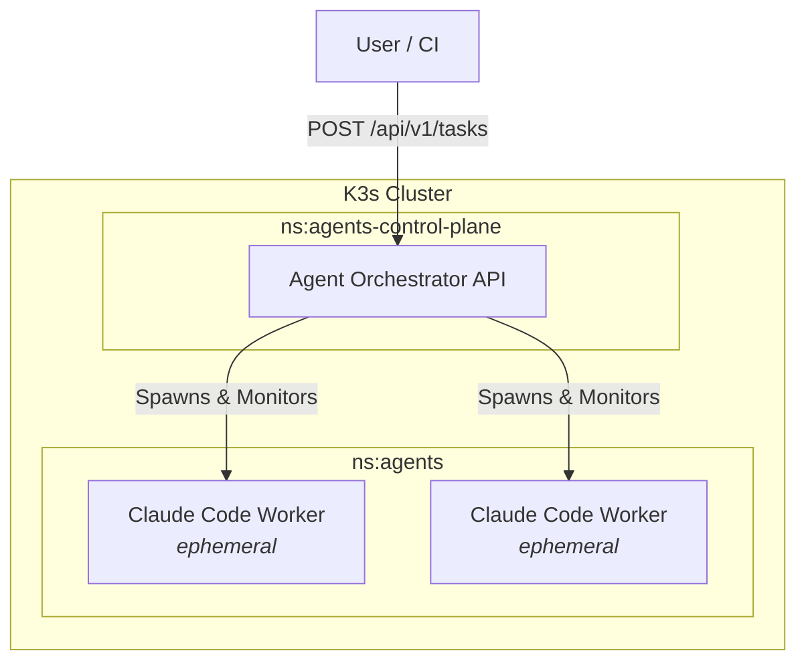

# Agent Orchestrator

This service acts as the control plane for launching autonomous AI agent containers. Currently, it orchestrates **Claude Code** containers, combining high-level reasoning with execution capabilities to perform tasks autonomously within the cluster.

**Infrastructure Source of Truth:** [github.com/compilercomplied/infrastructure](https://github.com/compilercomplied/infrastructure). Refer to this repository for cluster prerequisites and global configuration.

## Architecture

The orchestrator spawns ephemeral worker pods in a dedicated namespace (`agents`) while running in its own control plane namespace (`agents-control-plane`).



## Development

This project uses [mise](https://mise.jdx.dev/) for tool and task management.

### Setup

1. **Install Tools:**
   ```bash
   mise install
   ```

2. **Load Environment:**
   You must set the Pulumi passphrase and source the loader script to populate your shell with the necessary secrets (ANTHROPIC_API_KEY, GITHUB_TOKEN, KUBECONFIG) from the `iac` directory.

   ```bash
   # 1. Set Pulumi Passphrase
   export PULUMI_CONFIG_PASSPHRASE="your-passphrase-here"

   # 2. Source the environment loader (defaults to 'local' stack)
   source scripts/load-env.sh local
   ```

## Observability

The API uses structured JSON logging and Prometheus metrics. Worker pods are automatically labeled for log discovery in Grafana/Loki.

- **Logs:** Query Loki with `{app="claude-worker"}` to see real-time output from agents.
- **Metrics:** Available at `/metrics` for Prometheus scraping.
